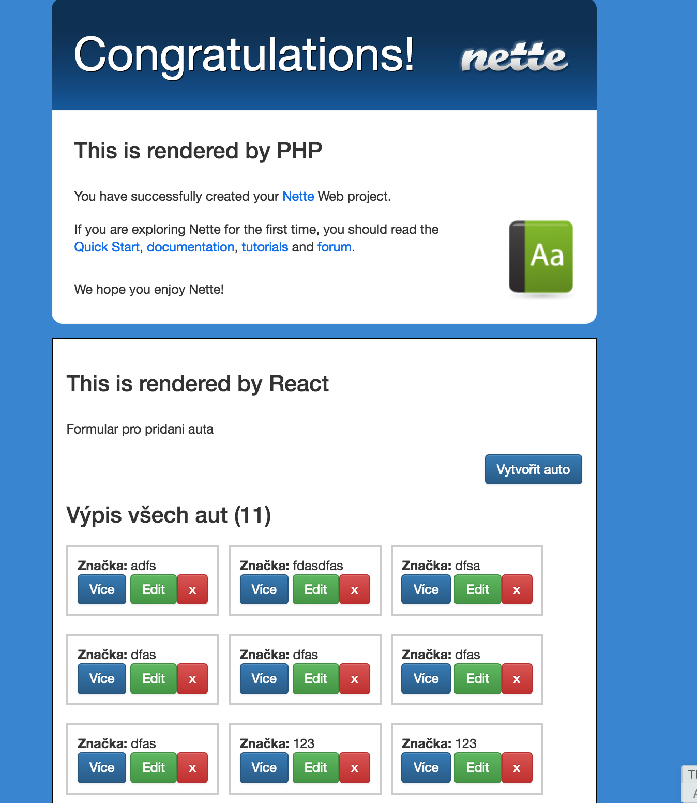

Nette-React example project
=================


Screen: 



* Clone repository

* Create databae named 'nette-react' in your MySQL server

* In app/config folder create *config.local.neon* from *config.local.neon.example*

* In terminal run:

  * ```composer install```

  * ```npm install```

  * ```bower install```

  * ```vendor/bin/phinx migrate```


# Launch application

In terminal run  

```node webpack/index```

```php www/index.php ipub:websockets:start```
